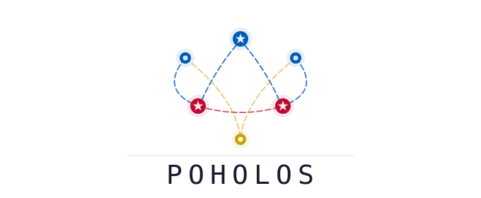

<div align="center">

<picture>
  <source media="(prefers-color-scheme: dark)" srcset="assets/logo-dark.svg">
  
</picture>

*по́голос* (poholos, ˈpo-ho-los) — rumor, hearsay.

</div>

A peer-to-peer mesh chat, carried entirely by Bluetooth Low Energy
**advertising frames**. No connections, no pairing, no GATT:
every node scans and advertises simultaneously, and messages flood
the mesh hop by hop until their TTL runs out.

## Workspace layout

```
crates/
├── poholos          # mesh protocol core: packets, wire codec, seen-cache,
│                    # router, airtime rotation - no_std-capable, zero I/O
├── poholos-cli      # tokio console app: chat loop + UDP/BLE transports
└── poholos-microbit # micro:bit v2 mesh-node firmware (Embassy, own
                     # workspace; validated end-to-end on hardware)
```

The core library never touches a socket or a radio. The router is a pure
state machine (`ingest(bytes) -> RouteAction`), which keeps the entire
protocol unit-testable and reusable from embedded targets. See
[`crates/poholos/README.md`](crates/poholos/README.md) for the core crate's
own API overview.

## Quick start

Two terminals on one machine (or any LAN), no Bluetooth needed:

```sh
cargo run -p poholos-cli -- --name alice --transport udp
cargo run -p poholos-cli -- --name bob   --transport udp
```

Type a short message to broadcast (*hearsay*). 
`@bob-9c01 hi` sends a unicast (*telegram*) — the wire id derives from the target's full display name,
no peer directory required.
`/quit` exits.

Received messages print with a local receive timestamp and addressing,
so logs from several nodes can be correlated during testing:

```
2026-06-11 14:32:07 [mb-60c6 → all] SOS - test
2026-06-11 14:32:09 [mb-60c6 → you] I am OK
```

Real BLE radio:

```sh
cargo run -p poholos-cli -- --name alice     # BLE is the default (no need for --transport ble)
```

`--name` appends a random 4-hex-digit suffix on every start; use
`--id alice-0001` instead to pin the full identity (and thus the wire
id) across restarts — required when something addresses you by a baked-in
name, like the micro:bit's buddy telegram.

## Wire format (version 0, max 22 bytes)

```
byte 0      : ver(2 bits)=0 | has_dest(1 bit) | ttl(5 bits)
bytes 1–2   : seq, u16 BE (starts random, wraps)
bytes 3–6   : src wire id, u32 BE (fnv64 of node name, truncated)
[bytes 7–10]: dest wire id, u32 BE - present iff has_dest
rest        : payload - ≤ 15 bytes hearsay, ≤ 11 bytes telegram
```

* `DEFAULT_TTL` = 16, `MAX_TTL` = 31. `hop()` refuses at `ttl <= 1`, so a
  TTL of 0 never appears on the wire.
* Dedup key = FNV-1a 64 over (flags, src, seq, dest?, payload) — TTL
  excluded so the same packet at different hop counts dedups correctly.
* Manufacturer-data company id `0xF10C` (above the assigned range; BlueZ
  silently drops `0xFFFF`).
* Oversized messages are rejected at the prompt, not fragmented (MVP).

## Library features

| Feature    | Default | Effect |
|------------|---------|--------|
| `std`      | yes     | `hashlink` seen-cache, `Backtrace` in errors |
| `serde`    | no      | `Serialize`/`Deserialize` on core types |
| `postcard` | no      | `to_postcard_slice`/`from_postcard` (no_std-friendly) |

Without `std` the crate is `no_std`: the seen-cache becomes a fixed
`[u64; 512]` ring and the wire codec works on borrowed buffers.

## Platform notes

These three platforms were validated on real radio.

| OS        | Scan | Advertise | Send budget |
|-----------|------|-----------|-----------------|
| Linux     | btleplug | BlueZ manufacturer data (`bluer`, `Type::Peripheral`) | 22 bytes |
| Windows 11| btleplug | `BluetoothLEAdvertisementPublisher` manufacturer data | 22 bytes |
| macOS     | btleplug | CoreBluetooth **128-bit service UUID** (1-byte tag+len) | **15 bytes** |

Windows cannot act as a GATT peripheral (HRESULT failure) — irrelevant
here, since poholos only broadcasts. macOS can *hear* full 22-byte frames
but can only *send* what fits a single 128-bit service UUID: 15 raw bytes
(one byte tags and lengths the frame), so hearsay typed on a Mac is capped
at 8 payload bytes and telegrams at 4. Extended advertising would lift
this between capable nodes and is a planned post-MVP optimization
(requires BT 5.0+ hardware).

## Verifying a fresh checkout

```sh
cargo fmt --all --check
cargo clippy --workspace --all-targets
cargo test  --workspace
cargo test  -p poholos --no-default-features   # no_std ring backend

# Embedded core (rustup target add thumbv7em-none-eabihf):
cargo build -p poholos --no-default-features --target thumbv7em-none-eabihf

# micro:bit v2 firmware (own workspace; build from inside the crate so
# its .cargo/config.toml target settings apply):
(cd crates/poholos-microbit && cargo build --release)
```

The Linux, Windows, and macOS advertisers, the btleplug scanner (both
frame shapes), and the micro:bit firmware are all validated on real
radio, including a two-hop Mac → Windows → micro:bit telegram
relay across encodings.

## micro:bit v2 firmware

`crates/poholos-microbit` is an Embassy-based full mesh node for the BBC
micro:bit v2 (nRF52833, `thumbv7em-none-eabihf`), radio via the Nordic
SoftDevice Controller + `trouble` (linked into the image — no separate
SoftDevice flash), validated end-to-end against Windows and macOS desktop
nodes, including a two-hop Mac → Windows → micro:bit relay.
It scans continuously, relays with the same flood/TTL/dedup semantics
and rotation airtime policy as the desktops, scrolls delivered messages
on the 5×5 LED matrix (telegrams to it get an `@` prefix and a chime on
the onboard speaker), and originates two canned messages:

* **Button A** — "I am OK" telegram to the preconfigured buddy node.
* **Button B** — "SOS - test" broadcast.

Known gap: the board only parses manufacturer-data advertisements, so it
cannot hear macOS nodes (which advertise a service UUID) directly yet —
they reach it relayed through a Linux or Windows node.

Identity is `mb-xxxx`, derived from the factory device id; the board
scrolls its own name at boot so you can `@mb-xxxx hello` it. The buddy
is baked in at compile time via `POHOLOS_BUDDY` (default `alice-0001`)
and pairs with a desktop holding a stable identity:

```sh
cargo install probe-rs-tools         # once; flashes via the onboard probe
# once: LLVM is needed at build time (bindgen for the Nordic SDC blob);
# on Windows: winget install LLVM.LLVM, then set LIBCLANG_PATH to its bin
cd crates/poholos-microbit
cargo run --release                  # flash + stream defmt logs

# on the desktop (--id pins the suffix so the buddy address stays valid):
cargo run -p poholos-cli -- --id alice-0001
```

## License

Split-licensed by component:

- **`poholos` core** (`crates/poholos`) — dual-licensed **MIT OR Apache-2.0**,
  at your option.
- **`poholos-cli` and `poholos-microbit`** — **AGPL-3.0-only**.

See [LICENSING.md](LICENSING.md) for details.
